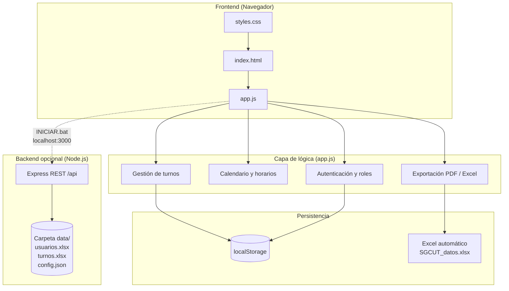

# SGCUT — Elite Salon Management

Sistema web para la gestión de turnos en barberías y salones de belleza. Permite registrar usuarios, agendar citas, administrar barberos y servicios, y exportar reportes en Excel y PDF.

---

## Objetivos del Proyecto

### Problema que resuelve

Las barberías y salones suelen llevar la agenda en papel o en herramientas dispersas, lo que genera:

- Solapamiento de horarios y citas duplicadas.
- Pérdida de datos al cerrar el navegador o cambiar de dispositivo.
- Dificultad para el administrador al revisar historial o generar reportes.

**SGCUT** centraliza la agenda digital, separa funciones entre **cliente** y **administrador**, y mantiene un registro ordenado de usuarios y turnos.

### Alcance de la aplicación

| Funcionalidad | Descripción |
|---------------|-------------|
| Registro e inicio de sesión | El cliente se registra con nombre, teléfono y contraseña. El admin usa credenciales fijas. |
| Calendario | Todos los días del mes habilitados (excepto fechas pasadas). Al elegir un día, la fecha se carga en el formulario de cita. |
| Agendamiento | Servicio, barbero, fecha, periodo AM/PM y franja horaria configurable. |
| Turnos activos | Listado, búsqueda, cancelación (usuario) o finalización (admin). |
| Historial y reportes | Admin exporta reporte completo en PDF y base Excel ordenada. |
| Configuración (admin) | Edición de nombre del negocio, horarios, barberos y catálogo de servicios. |
| Persistencia | Almacenamiento local en el navegador y exportación automática a Excel (`SGCUT_datos.xlsx`). Opcional: servidor Node.js con archivos en `data/`. |

---

## Arquitectura del Software

La aplicación sigue una arquitectura **cliente-servidor opcional**: funciona como SPA estática abriendo `index.html`, y puede complementarse con un backend local para guardar Excel en disco.



### Flujo resumido

1. El usuario abre la app (`ABRIR.bat` o `http://localhost:3000` con `INICIAR.bat`).
2. **Registro/login** valida credenciales contra datos en memoria (cargados desde `localStorage` o API).
3. Al **agendar**, se valida conflicto de horario, se guarda el turno y se actualiza el Excel ordenado.
4. El **admin** finaliza citas (pasan a historial) y puede descargar PDF o Excel desde el panel.

---

## Stack Tecnológico

| Capa | Tecnología | Uso |
|------|------------|-----|
| **Frontend** | HTML5 | Estructura semántica, formularios, vistas (login, dashboard, citas, historial, configuración). |
| **Estilos** | CSS3 | Tema oscuro tipo *glassmorphism*, diseño responsive, componentes de calendario y tarjetas. |
| **Lógica cliente** | JavaScript (ES6+) | SPA sin framework: rutas por vistas, roles, calendario, CRUD de turnos. |
| **Backend (opcional)** | Node.js + Express | API REST, archivos estáticos y escritura de Excel en `data/`. |
| **Excel** | [SheetJS (xlsx)](https://sheetjs.com/) | Generación y ordenamiento de hojas *Usuarios* y *Turnos*. |
| **PDF** | [jsPDF](https://github.com/parallax/jsPDF) + jsPDF-AutoTable | Reporte completo para administración. |
| **Persistencia local** | `localStorage` | Respaldo en el navegador (`sgcut_turnos`, `sgcut_usuarios`, `sgcut_config`). |
| **Herramientas** | Git, VS Code / Cursor | Control de versiones y desarrollo. |

> **Nota:** No se utiliza TailwindCSS ni PHP en este proyecto; el diseño es CSS personalizado.

---

## Modelo de Datos

### Tipo de base de datos

**Híbrido no relacional:**

- **Primario en cliente:** almacenamiento clave-valor del navegador (`localStorage`), estructuras JSON.
- **Exportación estructurada:** archivos **Excel** (.xlsx) como “base de datos” legible para el negocio.
- **Opcional en servidor:** mismos datos materializados en `data/usuarios.xlsx`, `data/turnos.xlsx` y `config.json`.

No se usa una base relacional (MySQL/PostgreSQL) ni una nube externa obligatoria; la ubicación es **interna** (PC del usuario o carpeta del proyecto).

### Entidades principales

**Usuario (`registeredUsers` / hoja Usuarios)**

| Campo | Tipo | Descripción |
|-------|------|-------------|
| `id` | string | Identificador único |
| `name` | string | Nombre completo |
| `phone` | string | Teléfono (usuario de login) |
| `password` | string | Contraseña |
| `role` | string | `user` o `admin` |
| `createdAt` | ISO date | Fecha de registro |

**Turno (`turnos` / `historial` / hoja Turnos)**

| Campo | Tipo | Descripción |
|-------|------|-------------|
| `id` | string | Identificador único |
| `clientName` | string | Nombre del cliente |
| `clientPhone` | string | Teléfono |
| `serviceId` | string | ID del servicio |
| `duration` | number | Minutos |
| `barber` | string | Barbero asignado |
| `date` | string | Fecha (YYYY-MM-DD) |
| `time` | string | Hora + AM/PM |
| `createdBy` | string | Teléfono/usuario que creó la cita |
| `status` | string | `pending` o `completed` |
| `createdAt` / `completedAt` | ISO date | Trazabilidad |

**Configuración (`config`)**

| Campo | Descripción |
|-------|-------------|
| `businessName` | Nombre del local |
| `openTime` / `closeTime` | Horario de atención |
| `slotInterval` | Duración de cada turno (min) |
| `services[]` | Catálogo: `id`, `name`, `duration` |
| `barbers[]` | Lista de barberos |

### Ordenamiento en Excel

- **Usuarios:** por nombre y teléfono (orden alfabético).
- **Turnos:** por fecha, hora, estado y nombre del cliente.

### Ubicación de los archivos

| Modo | Ubicación |
|------|-----------|
| Sin servidor | `Descargas/SGCUT_datos.xlsx` (actualización automática al guardar) |
| Con servidor (`INICIAR.bat`) | `proyecto/data/usuarios.xlsx`, `turnos.xlsx`, `config.json` |

---

## Metodología con IA

El desarrollo se aceleró con asistencia de **IA generativa** (Antigravity / Gemini y Cursor Agent), siguiendo este esquema:

1. **Definición de requisitos:** El equipo planteó funciones (registro, calendario, roles, Excel, PDF, panel admin). La IA ayudó a traducirlas en tareas concretas de frontend y backend.
2. **Generación y refactorización de código:** Se produjeron `index.html`, `styles.css`, `app.js` y `server.js`, con iteraciones para calendario de todos los días, eliminación de precio sugerido, alertas de confirmación y exportación ordenada.
3. **Depuración asistida:** Ante errores (servidor no detectado, persistencia en `file://`), la IA propuso modo sin servidor + Excel automático con SheetJS y scripts `ABRIR.bat` / `INICIAR.bat`.
4. **Documentación:** Este README y ajustes de UX (mensajes de estado, guía “Cómo usar” solo para usuarios) se redactaron con apoyo de IA y revisión humana.

**Rol de la IA:** copiloto para velocidad y consistencia. **Rol del desarrollador:** validar reglas de negocio, probar flujos reales y aprobar el producto final.

---

## Uso rápido

| Acción | Cómo |
|--------|------|
| Abrir sin instalar nada extra | Doble clic en `ABRIR.bat` o abrir `index.html` |
| Abrir con Excel en carpeta `data/` | Ejecutar `INICIAR.bat` (requiere [Node.js](https://nodejs.org)) → `http://localhost:3000` |
| Admin | Usuario: `admin` — Contraseña: `admin123` |
| Cliente | Pestaña **Registrarse** → teléfono + contraseña → luego iniciar sesión con el teléfono |

---

## Estructura del repositorio

```
aporte-de-diseño/
├── index.html          # Interfaz principal
├── styles.css          # Estilos
├── app.js              # Lógica de la aplicación
├── server.js           # API opcional (Node.js)
├── package.json        # Dependencias del servidor
├── data/               # Excel y config (con servidor)
├── ABRIR.bat           # Abre la app en el navegador
├── INICIAR.bat         # Inicia servidor + navegador
└── README.md           # Este documento
```

---

## Licencia y autoría

Proyecto académico / aporte de diseño — SGCUT.  
Desarrollado con HTML, CSS, JavaScript y asistencia de IA (Antigravity/Gemini).
